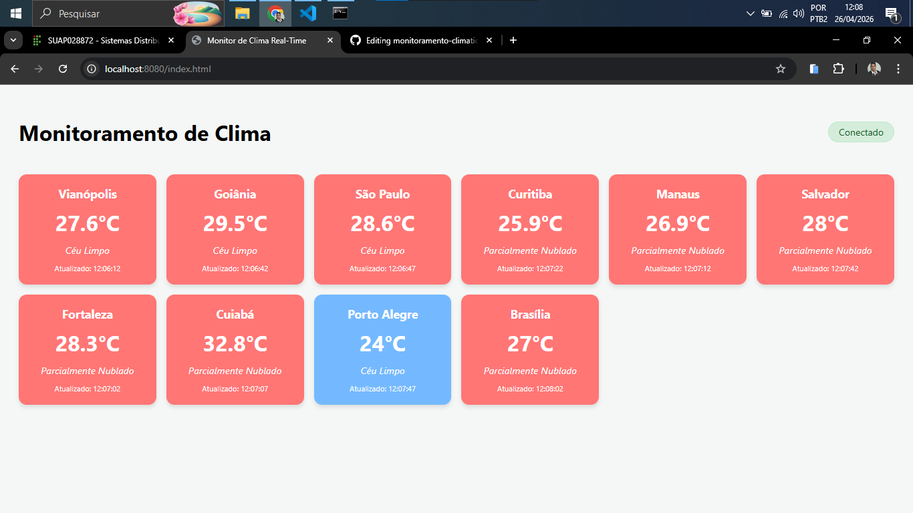
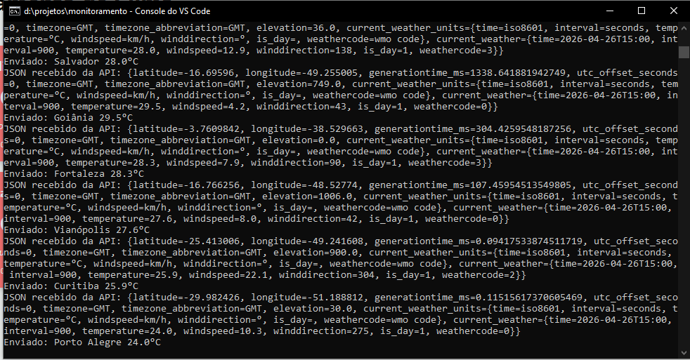

# 🌡️ Monitor de Temperatura em Tempo Real com WebSockets

Este projeto é uma demonstração técnica de uma aplicação de monitorização climática utilizando **Spring Boot**, **WebSockets (STOMP + SockJS)** e a API pública **Open-Meteo**. O sistema realiza o broadcast de temperaturas de 10 cidades brasileiras em tempo real para um dashboard interativo.

## 🚀 Tecnologias Utilizadas

* **Java 21**
* **Spring Boot 3.x**
* **Spring WebSocket** (STOMP & SockJS)
* **Open-Meteo API** (Dados climáticos gratuitos e sem chave de API)
* **Vanilla JS & CSS3** (Front-end responsivo)

---

## 🛠️ Como Executar o Projeto

### Pré-requisitos
* JDK 21 instalado.
* Maven 3.x ou superior.

### Passo a Passo
1.  **Clone o repositório:**
    ```bash
    git clone [https://github.com/seu-usuario/monitoramento-clima.git](https://github.com/seu-usuario/monitoramento-clima.git)
    cd monitoramento-clima
    ```

2.  **Compile e execute a aplicação:**
    ```bash
    mvn spring-boot:run
    ```

3.  **Aceda ao Dashboard:**
    Abra o seu navegador e aceda a:
    `http://localhost:8080/index.html`

---

## 🔄 Fluxo de Mensagens e Lógica

O projeto utiliza uma arquitetura de mensageria assíncrona. Abaixo descreve-se o ciclo de vida de uma atualização:

1.  **Agendamento (`@Scheduled`):** No servidor, uma tarefa automática é disparada a cada 5 segundos.
2.  **Sorteio e Localização:** O serviço escolhe aleatoriamente uma cidade da lista de 10 cidades pré-definidas (que contém Nome, Latitude e Longitude).
3.  **Consumo de API Externa:** O servidor faz um pedido HTTP `GET` à API Open-Meteo. 
    * *Nota:* É utilizado `Locale.US` na formatação da URL para garantir que as coordenadas usem o ponto decimal (ex: `-16.74`) em vez da vírgula, evitando erros de `400 Bad Request`.
4.  **Processamento de Dados:** O JSON de resposta é mapeado e o `weathercode` é traduzido para uma descrição legível (ex: "Céu Limpo", "Chuvoso").
5.  **Broadcast via WebSocket:** O servidor envia o objeto de dados (Payload) para o tópico `/topic/clima` através do `SimpMessagingTemplate`.
6.  **Atualização no Cliente (Front-end):**
    * O cliente Web está subscrito ao tópico `/topic/clima`.
    * Ao receber os dados, o JavaScript localiza o card específico da cidade através do ID.
    * Os valores são atualizados e a cor do card muda dinamicamente: **Vermelho** para calor (> 25°C) e **Azul** para frio (≤ 25°C).

---

## 📁 Estrutura de Pastas

* `src/main/java/.../model/Cidades.java`: Modelo de dados com coordenadas reais.
* `src/main/java/.../services/ClimaService.java`: Lógica de agendamento, consumo de API e envio de mensagens.
* `src/main/java/.../config/WebSocketConfig.java`: Configuração do broker STOMP e endpoint SockJS.
* `src/main/resources/static/index.html`: Interface visual (HTML/CSS/JS).

---

## 📝 Notas Técnicas

* **Interatividade:** O dashboard inicia com todos os cards em estado de "Aguardando...". À medida que o servidor envia atualizações, os cards ganham cor e dados.
* **Ambiguidade no Java:** Foi aplicado um cast para `(Object)` no método `convertAndSend` para resolver conflitos de sobrecarga de métodos do Spring Framework.
* **Responsividade:** O layout utiliza CSS Grid, adaptando-se automaticamente ao tamanho da janela do navegador.

---

## 📸 Prints do Projeto

Nesta seção, pode ver o funcionamento do sistema tanto no terminal (backend) quanto na interface do utilizador (frontend).

### Painel de Monitorização (Frontend)


### Log do Servidor (Console/Backend)

